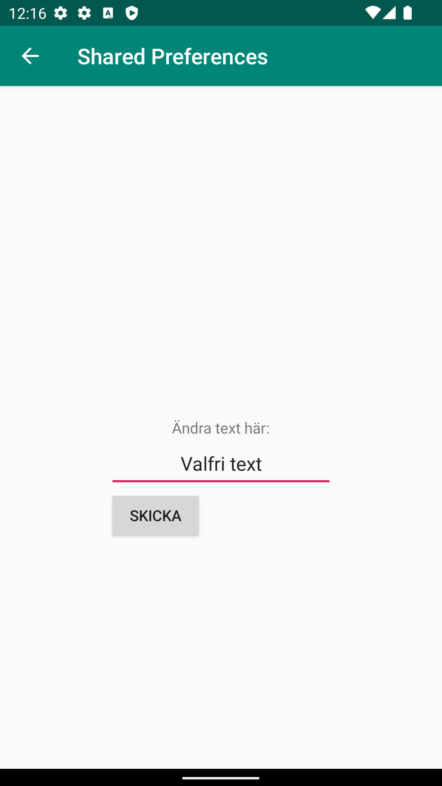
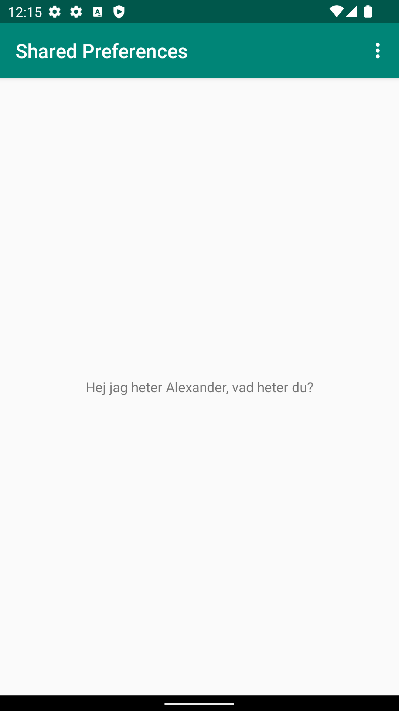
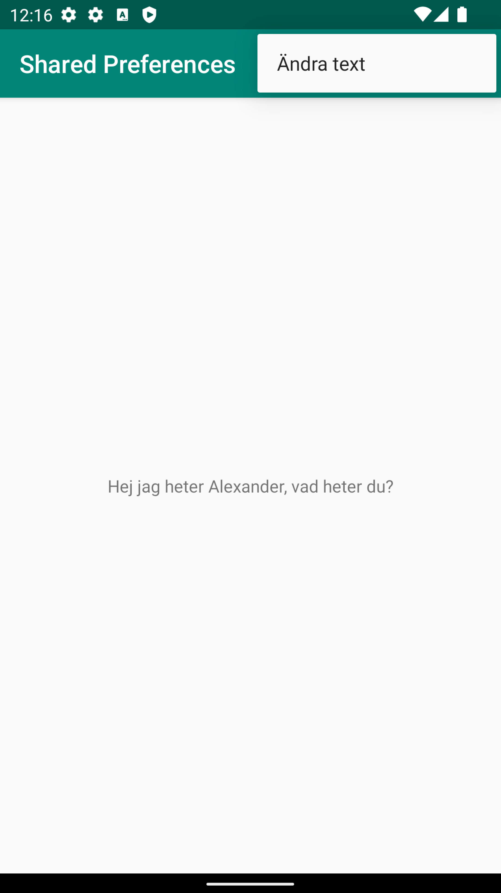

# Assignment 6: Shared preferences

## Shared Preferences instans
Shared Preferences är en metod som kan användas för att bevara ett värde. När man sätter en text för en viss widget kommer den
att försvinna så fort appen avslutas. Men med hjälp av shared preferences kan dessa värden sparas i en fil, för att sedan hämta
denna data och visa den på alla önskade ställen. Senare kommer värdet att bestämmas men först instansieras ett Shared Preferences objekt,
kod för detta syns nedan. 

```
  preferences = getSharedPreferences("preferences", MODE_PRIVATE);
```
_Figur 1.1 Kod för att instansera Shared Preferences_

## Second Activity - Andra aktiviteten
Eftersom värdet för shared preferences ska bestämmas i en annan aktivitet skapas den i namnet activity_second.xml. Den
innehåller tre widgets, där den första är en vanlig TextView med beskrivande text, den andra är en EditText där användaren
skriver in den text den önskar skicka, och den sista är en button där en click listner kommer kunna sättas för att skicka all
extras till en ny intent. Koden för dessa funktioner beskrivs i SecondActivity.java och syns nedan. Det som händer är att variablerna
länkas till sina widgets för att sedan skapa en click listner på knappen, och när den triggas skickas en intent med datan från
EditText widgeten som skapades tidigare.

```
        button = findViewById(R.id.set_button);
        textToSend = findViewById(R.id.input_text);

        button.setOnClickListener(new View.OnClickListener() {
            @Override
            public void onClick(View view) {
                // Instanserar ny intent och hämtar textvärde
                Intent intent = new Intent(SecondActivity.this, MainActivity.class);
                textToSendString = textToSend.getText().toString();

                // Lägger till extras i intent
                intent.putExtra("text", textToSendString);
                startActivity(intent);
            }
        });
```
_Figur 2.1 kod för click listner_



_Figur 2.2 Andra aktivitet för att ändra text_

## Meny
Nu när en andra aktivitet finns måste denna kunna kommas åt på något sätt, och i detta fall görs detta med en meny. Det första som behövs
är en resurs för menyn som i detta fallet heter menu.xml (figur 3.1), här besrivs alltså layouten för menyn alltså de knappar som finns i menyn.
Här finns i dagsläget enbart ett alternativ som just tar en till den andra aktiviteten som skapades. 

```
<?xml version="1.0" encoding="utf-8"?>
<menu xmlns:android="http://schemas.android.com/apk/res/android">
    <item android:id="@+id/change_text"
        android:title="Ändra text" />
</menu>
```
_Figur 3.1 XML för meny_

Den kod som behövs för att göra menyn synlig finns i main och syns nedan i figur 3.2. Menyn består i detta fall av två olika komponenter,
onCreateOptionsMenu och onOptionsItemSelected, där den första triggas för att skapa menyn. Den andra styr vad som händer när något
alternativ i menyn väljs. Här finns en switch som gör det enkelt att lägga till ytterligare alternativ i framtiden. Den som finns
i dagsläget startar en intent som tar användaren till den andra aktivitet, som var målet.

```
    public boolean onCreateOptionsMenu(Menu menu)
    {
        // Visar menyalternativ i menyn
        MenuInflater inflater = getMenuInflater();
        inflater.inflate(R.menu.menu, menu);
        return true;
    }

    public boolean onOptionsItemSelected(MenuItem item) {

        switch (item.getItemId()) {
            // När Ändra text väljs i menyn skapas en ny intent
            case R.id.change_text:
                startActivity(new Intent(this, SecondActivity.class));
                return true;
            default:
                return super.onOptionsItemSelected(item);
        }
    }
```
_Figur 3.2 Java kod för meny_



_Figur 3.3 Startsidan med menyn inaktiv_




_Figur 3.3 Startsidan med menyn aktiv_

## Bundle och Shared Preferences Editor
När den tidigare aktiviteten skickar en intent fångas den upp och läggs i strängen text som syns i koden nedan (Figur 4.1). Det som händer
är att så fort innehåll i extras hittas, som är en bundle från tidigare intent, läggs detta värdet i strängen som nämndes tidigare och
värdet för denna strängen lägs sedan i shared prefernces nyckeln text. Slutligen kan funktionen för onResume visa denna text så fort
aktiviteten öppnas igen, detta syns i figur 4.2 nedan.

```
        // Om extras från tidigare intent finns så lägg detta i shared preferences
        if (extras != null) {
            String text = extras.getString("text");
            SharedPreferences.Editor editor = preferences.edit();
            editor.putString("text" , text);
            editor.apply();
        }
```
_Figur 4.1 Kod för att definera värdet från extras i Shared Preferences_

```
    protected void onResume() {
        super.onResume();

        // Sätter texten för textview till värdet från shared preferences
        String name = preferences.getString("text", "ingen text hittades");
        textViewName.setText(name);
    }
```
_Figur 4.2 kod för att visa Shared Preference värdet_


_Video exempel på hur appen fungerar_